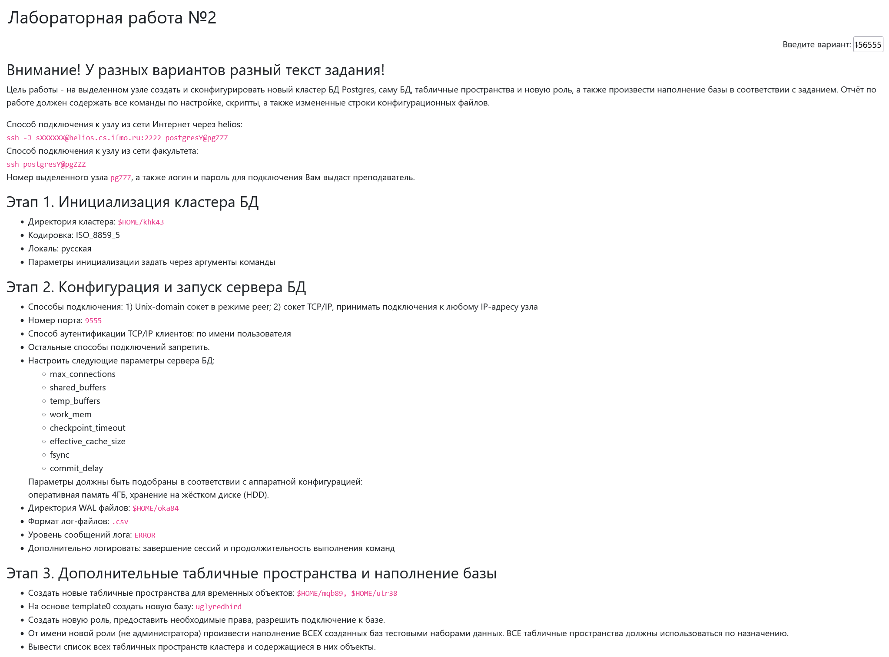

Цель работы - на выделенном узле создать и сконфигурировать новый кластер БД Postgres, саму БД, табличные пространства и новую роль, а также произвести наполнение базы в соответствии с заданием. Отчёт по работе должен содержать все команды по настройке, скрипты, а также измененные строки конфигурационных файлов.

Способ подключения к узлу из сети Интернет через helios:
ssh -J sXXXXXX@helios.cs.ifmo.ru:2222 postgresY@pgZZZ
Способ подключения к узлу из сети факультета:
ssh postgresY@pgZZZ
Номер выделенного узла pgZZZ, а также логин и пароль для подключения Вам выдаст преподаватель.

Этап 1. Инициализация кластера БД

    Директория кластера: $HOME/khk43
    Кодировка: ISO_8859_5
    Локаль: русская
    Параметры инициализации задать через аргументы команды

Этап 2. Конфигурация и запуск сервера БД

    Способы подключения: 1. Unix-domain сокет в режиме peer; 2. сокет TCP/IP, принимать подключения к любому IP-адресу узла
    Номер порта: 9555
    Способ аутентификации TCP/IP клиентов: по имени пользователя
    Остальные способы подключений запретить.
    Настроить следующие параметры сервера БД:
        max_connections
        shared_buffers
        temp_buffers
        work_mem
        checkpoint_timeout
        effective_cache_size
        fsync
        commit_delay
    Параметры должны быть подобраны в соответствии с аппаратной конфигурацией:
    оперативная память 4ГБ, хранение на жёстком диске (HDD).
    Директория WAL файлов: $HOME/oka84
    Формат лог-файлов: .csv
    Уровень сообщений лога: ERROR
    Дополнительно логировать: завершение сессий и продолжительность выполнения команд

Этап 3. Дополнительные табличные пространства и наполнение базы

    Создать новые табличные пространства для временных объектов: $HOME/mqb89, $HOME/utr38
    На основе template0 создать новую базу: uglyredbird
    Создать новую роль, предоставить необходимые права, разрешить подключение к базе.
    От имени новой роли (не администратора) произвести наполнение ВСЕХ созданных баз тестовыми наборами данных. ВСЕ табличные пространства должны использоваться по назначению.
    Вывести список всех табличных пространств кластера и содержащиеся в них объекты.