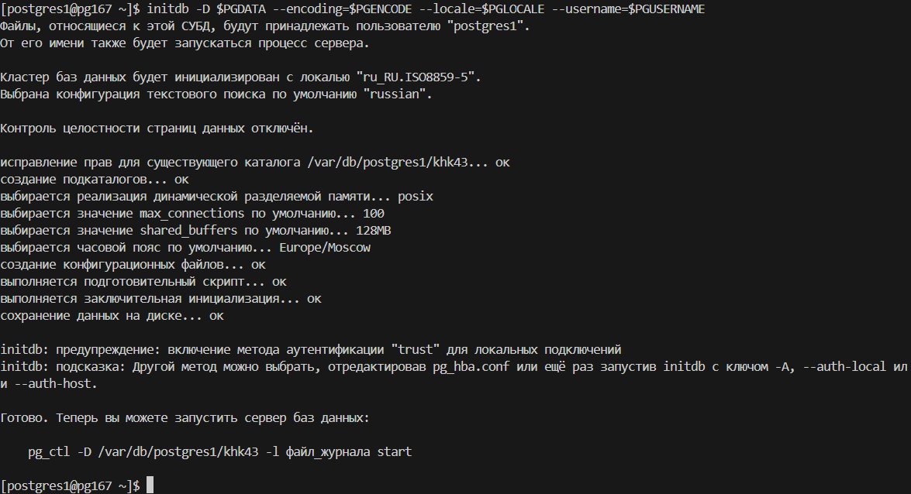

# Подключение
```bash
ssh s372819@se.ifmo.ru -p 2222
ssh postgres1@pg167
```
Подключение к БД из Гелиос TCP/IP с паролем (пользователь уже должен быть создан):
```bash
psql -p 9555 -h pg167 -d postgres -U testuser # Пароль: testpassword
```

# Запуск полного скрипта
```bash
./scripts/restart.sh # Удаляет созданные файлы
./scripts/SUBD_LAB2.sh # Запускает полный скрипт
```

Определим переменные окружения:
```bash
PGUSERNAME=postgres1
PGDATA=$HOME/khk43
PGENCODE=ISO_8859_5
PGLOCALE=ru_RU.ISO8859-5
export PGUSERNAME PGDATA PGENCODE PGLOCALE
```

Создадим директорию для WAL файлов:
```bash
mkdir -p $HOME/oka84
chown $PGUSERNAME $HOME/oka84
```

# Этап 1. Инициализация кластера БД

Создаем директорию кластера и инициализируем базу данных:
```bash
mkdir -p $PGDATA
chown $PGUSERNAME $PGDATA
initdb -D $PGDATA --encoding=$PGENCODE --locale=$PGLOCALE --username=$PGUSERNAME --waldir=$HOME/oka84/pg_wal
```



# Этап 2. Конфигурация и запуск сервера БД

Скачиваем конфигурационные файлы:

```bash
scp postgres1@pg167:khk43/postgresql.conf ~
scp postgres1@pg167:khk43/pg_hba.conf ~
```

## Настройка способов подключения:
Редактируем файл `postgresql.conf`:
 - сокет TCP/IP, принимать подключения к любому IP-адресу узла
 - Номер порта: 9555
```conf
# - Connection Settings -

listen_addresses = '*'		# what IP address(es) to listen on;
					# comma-separated list of addresses;
					# defaults to 'localhost'; use '*' for all
					# (change requires restart)
port = 9555				# (change requires restart)
```

Редактируем файл `pg_hba.conf`:
 - Unix-domain сокет в режиме peer
 - Способ аутентификации TCP/IP клиентов: по имени пользователя
 - Остальные способы подключений запретить.
Из-за проблем ident в Гелиос, меняем на md5.

```conf
# TYPE  DATABASE        USER            ADDRESS                 METHOD

# Разрешить локальные подключения через Unix-domain сокет с аутентификацией peer
local   all             all                                     peer
# Разрешить TCP/IP подключения со всех IP-адресов с аутентификацией по имени пользователя (ident)
host    all             all             0.0.0.0/0               md5
host    all             all             ::/0                    md5
# Запретить все остальные подключения
local   replication     all                                     reject
host    replication     all             127.0.0.1/32            reject
host    replication     all             ::1/128                 reject
```
`postgresql.conf`:
```conf
password_encryption = md5	# scram-sha-256 or md5
```

## Настроить следующие параметры сервера БД:
**max_connections**:
```conf
max_connections = 100
```

**shared_buffers**:
Ставим 1/4 от оперативной памяти согласно документации [postgresql](https://www.postgresql.org/docs/current/runtime-config-resource.html#GUC-SHARED-BUFFERS), т.е. 1ГБ.
```conf
shared_buffers = 1GB
```

**temp_buffers**:
Количество памяти, выделенной для временных таблиц на одну сессию. Учитывая максимальное количество соединений, temp_buffers займут 100 * 16MB = 1600MB.
```conf
temp_buffers = 16MB
```

**work_mem**:
Количество памяти, выделенной для операций сортировки и хеширования на одно соединение. Не зная какого вида операции будут производиться, (сложные соединения и сортировки или простые запросы) то оставляем значение по умолчанию 4MB. Work_mem максимально может занимать 100 * 4MB = 400MB.
```conf
work_mem = 4MB
```

**checkpoint_timeout**:
Интервал времени между контрольными точками (checkpoints). Контрольные точки обеспечивают согласованность данных на диске. Учитывая, что у нас HDD, более длинный интервал времени между контрольными точками уменьшит нагрузку на диск.
```conf
checkpoint_timeout = 15min
```
**effective_cache_size**:
Этот параметр представляет собой оценку для планировщика о количестве дискового кэша, доступного для PostgreSQL. Это значение должно быть больше shared_buffers. Учитывая, что у нас HDD, то операции ввода-вывода будут медленными, поэтому считывание из кэша будет предпочтительнее. Так, ставим 75% от оперативной памяти, т.е. 3ГБ.
```conf
effective_cache_size = 3GB
```
**fsync**:
Этот параметр должен быть включен для обеспечения безопасности данных в случае сбоя системы. Отключение этого параметра может улучшить производительность, но риск потери данных в случае сбоя неприемлем для большинства производственных систем.
```conf
fsync = on
```
**commit_delay**:
Этот параметр задает задержку в миллисекундах перед сохранением WAL. Без тестирования сложно подобрать оптимальное значение. По умолчанию 0.
```conf
commit_delay = 0
```

## WAL файлы и логирование:

**Директория WAL файлов**:

Это сделано при самом initdb.

 - `archive_mode` - включает архивирование WAL файлов.
```conf
archive_mode = on
```

**Формат лог-файлов**:

 - `log_destination` - куда писать логи. В данном случае, в файл csv.
 - `logging_collector` - включает сборщик логов и позволяет перенаправлять в файлы.
 - `log_directory` - директория для логов. Оставляем по умолчанию.
 - `log_filename` - формат имени файла лога. Ставим формат csv.

```conf
log_destination = 'csvlog'
logging_collector = on
log_directory = 'log'
log_filename = 'postgresql-%Y-%m-%d_%H%M%S.log' # .log будет заменено на .csv автоматически
```

**Уровень сообщений лога**:
 - `log_min_messages` - минимальный уровень сообщений, которые будут записаны в лог. В данном случае, только ошибки и выше.
```conf
log_min_messages = error
```

**Дополнительно логировать**:
 - `log_connections` - логировать подключения.
 - `log_disconnections` - логировать отключения. Оба параметра используем для отслеживания завершения сессий.
 - `log_duration` - логировать продолжительность выполнения команд.
 - `log_min_duration_statement` - минимальная продолжительность выполнения команды, которая будет логироваться. В данном случае 0 - логировать все команды.
```conf
log_connections = on
log_disconnections = on
log_duration = on
log_min_duration_statement = 0
```

## Запуск сервера БД

Загрузим обратно конфигурационные файлы:
```bash
scp ~/postgresql.conf postgres1@pg167:khk43
scp ~/pg_hba.conf postgres1@pg167:khk43
```

Запускаем сервер:
```bash
pg_ctl -D /var/db/postgres1/khk43 -l файл_журнала start
```

**Остановка сервера**:
```bash
pg_ctl -D ~/khk43 stop -m fast
```

## Проверка всех параметров

**Статус сервера**:
```bash
pg_ctl -D ~/khk43 status
```
```output
[postgres1@pg167 ~]$ pg_ctl -D ~/khk43 status
pg_ctl: сервер работает (PID: 63080)
/usr/local/bin/postgres "-D" "/var/db/postgres1/khk43"
```

**Подключение локально**:
```bash
psql -p 9555 -d postgres
```
```output
[postgres1@pg167 ~]$ psql -p 9555 -d postgres
psql (16.4)
Введите "help", чтобы получить справку.

postgres=#
```

**Подключение удаленно**:
Создадим нового пользователя PostgreSQL с паролем:
```sql
CREATE ROLE testuser WITH LOGIN PASSWORD 'testpassword';
```

Попробуем подключиться удаленно:
```bash
psql -h pg167 -p 9555 -U testuser -d postgres
```
```output
[s372819@helios ~]$ psql -h pg167 -p 9555 -U testuser -d postgres
Пароль пользователя testuser: 
psql (16.4)
Введите "help", чтобы получить справку.

postgres=> 
```

**Проверка параметров**:
```sql
SHOW max_connections;
SHOW shared_buffers;
SHOW temp_buffers;
SHOW work_mem;
SHOW checkpoint_timeout;
SHOW effective_cache_size;
SHOW fsync;
SHOW commit_delay;
```
```output
postgres=# SHOW max_connections;
SHOW shared_buffers;
SHOW temp_buffers;
SHOW work_mem;
SHOW checkpoint_timeout;
SHOW effective_cache_size;
SHOW fsync;
SHOW commit_delay;
 max_connections 
-----------------
 100
(1 строка)

 shared_buffers
----------------
 1GB
(1 строка)

 temp_buffers
--------------
 16MB
(1 строка)

 work_mem
----------
 4MB
(1 строка)

 checkpoint_timeout
--------------------
 15min
(1 строка)

 effective_cache_size
----------------------
 3GB
(1 строка)

 fsync
-------
 on
(1 строка)

 commit_delay
--------------
 0
(1 строка)

postgres=# 
```

# Этап 3. Дополнительные табличные пространства и наполнение базы

## Создание табличных пространств

```bash
mkdir -p /var/db/postgres1/mqb89
mkdir -p /var/db/postgres1/utr38
```

```sql
CREATE TABLESPACE mqb89 LOCATION '/var/db/postgres1/mqb89';
CREATE TABLESPACE utr38 LOCATION '/var/db/postgres1/utr38';
```

**Проверка**:
```sql
\db
```
```output
postgres=# \db
           Список табличных пространств
    Имя     | Владелец  |      Расположение
------------+-----------+-------------------------
 mqb89      | postgres1 | /var/db/postgres1/mqb89
 pg_default | postgres1 | 
 pg_global  | postgres1 |
 utr38      | postgres1 | /var/db/postgres1/utr38
(4 строки)
```

## Создание базы данных

```sql
CREATE DATABASE uglyredbird TEMPLATE template0;
```

**Проверка**:
```sql
SELECT datname AS "Имя",
       pg_roles.rolname AS "Владелец",
       pg_encoding_to_char(encoding) AS "Кодировка",
       datcollate AS "LC_COLLATE",
       datctype AS "LC_CTYPE"
FROM pg_database
JOIN pg_roles ON pg_database.datdba = pg_roles.oid
ORDER BY datname;
```
```output
     Имя     | Владелец  | Кодировка  |   LC_COLLATE    |    LC_CTYPE
-------------+-----------+------------+-----------------+-----------------
 postgres    | postgres1 | ISO_8859_5 | ru_RU.ISO8859-5 | ru_RU.ISO8859-5
 template0   | postgres1 | ISO_8859_5 | ru_RU.ISO8859-5 | ru_RU.ISO8859-5
 template1   | postgres1 | ISO_8859_5 | ru_RU.ISO8859-5 | ru_RU.ISO8859-5
 uglyredbird | postgres1 | ISO_8859_5 | ru_RU.ISO8859-5 | ru_RU.ISO8859-5
(4 строки)
```

## Создание роли

```sql
CREATE ROLE newuser WITH LOGIN;  --Пароль не нужен так как используем подключение peer
-- Предоставить необходимые права
GRANT CONNECT, CREATE ON DATABASE uglyredbird TO newuser;
GRANT CREATE ON TABLESPACE mqb89 TO newuser;
GRANT CREATE ON TABLESPACE utr38 TO newuser;

-- Устанавливаем табличные пространства для временных объектов
ALTER SYSTEM SET temp_tablespaces = 'mqb89', 'utr38';

-- Перезагружаем конфигурацию
SELECT pg_reload_conf();
```

## От имени новой роли (не администратора) произвести наполнение ВСЕХ созданных баз тестовыми наборами данных. ВСЕ табличные пространства должны использоваться по назначению.
Запускаем скрипт наполнения базы от имени нового пользователя:
```bash
psql -p 9555 -d uglyredbird -U newuser -f $HOME/newuser.sql
```

**Проверка**:
```sql
SELECT * FROM pg_catalog.pg_tables WHERE tableowner = 'newuser';
```
```output
 schemaname |       tablename        | tableowner | tablespace | hasindexes | hasrules | hastriggers | rowsecurity
------------+------------------------+------------+------------+------------+----------+-------------+-------------
 main       | students               | newuser    |            | t          | f        | f           | f
 main       | courses                | newuser    |            | t          | f        | f           | f
 pg_temp_3  | temp_enrollments       | newuser    | utr38      | t          | f        | f           | f
 pg_temp_3  | temp_course_statistics | newuser    | mqb89      | f          | f        | f           | f
(4 строки)
```

## Вывести список всех табличных пространств кластера и содержащиеся в них объекты

Выведем все объекты в табличных пространствах
```sql
SELECT
    spcname AS tablespace,
    relname
FROM
    pg_class
    JOIN pg_tablespace ON pg_tablespace.oid = reltablespace;
```
```output
 tablespace |                 relname
------------+-----------------------------------------
 utr38      | temp_enrollments
 mqb89      | temp_enrollments_pkey
 mqb89      | temp_course_statistics
 pg_global  | pg_toast_1262
 pg_global  | pg_toast_1262_index
 pg_global  | pg_toast_2964
 pg_global  | pg_toast_2964_index
 pg_global  | pg_toast_1213
 pg_global  | pg_toast_1213_index
 pg_global  | pg_toast_1260
 pg_global  | pg_toast_1260_index
 pg_global  | pg_toast_2396
 pg_global  | pg_toast_2396_index
 pg_global  | pg_toast_6000
 pg_global  | pg_toast_6000_index
 pg_global  | pg_toast_3592
 pg_global  | pg_toast_3592_index
 pg_global  | pg_toast_6243
 pg_global  | pg_toast_6243_index
 pg_global  | pg_toast_6100
 pg_global  | pg_toast_6100_index
 pg_global  | pg_database_datname_index
 pg_global  | pg_database_oid_index
 pg_global  | pg_db_role_setting_databaseid_rol_index
 pg_global  | pg_tablespace_oid_index
 pg_global  | pg_tablespace_spcname_index
 pg_global  | pg_authid_rolname_index
 pg_global  | pg_authid_oid_index
 pg_global  | pg_auth_members_oid_index
 pg_global  | pg_auth_members_role_member_index
 pg_global  | pg_auth_members_member_role_index
 pg_global  | pg_auth_members_grantor_index
 pg_global  | pg_shdepend_depender_index
 pg_global  | pg_shdepend_reference_index
 pg_global  | pg_shdescription_o_c_index
 pg_global  | pg_replication_origin_roiident_index
 pg_global  | pg_replication_origin_roname_index
 pg_global  | pg_shseclabel_object_index
 pg_global  | pg_parameter_acl_parname_index
 pg_global  | pg_parameter_acl_oid_index
 pg_global  | pg_subscription_oid_index
 pg_global  | pg_subscription_subname_index
 pg_global  | pg_authid
 pg_global  | pg_subscription
 pg_global  | pg_database
 pg_global  | pg_db_role_setting
 pg_global  | pg_tablespace
 pg_global  | pg_auth_members
 pg_global  | pg_shdepend
 pg_global  | pg_shdescription
 pg_global  | pg_replication_origin
 pg_global  | pg_shseclabel
 pg_global  | pg_parameter_acl
(53 строки)
```


Выведем все объекты созданные новым пользователем:
```sql
SELECT
    relname, spcname AS tablespace
FROM
    pg_class LEFT JOIN pg_tablespace ON pg_tablespace.oid = reltablespace
WHERE
    relowner = (SELECT oid FROM pg_roles WHERE rolname = 'newuser');
```
```output
           relname            | tablespace
------------------------------+------------
 students_student_id_seq      |
 students                     |
 students_pkey                |
 courses_course_id_seq        |
 courses                      |
 courses_pkey                 |
 temp_enrollments_temp_id_seq |
 temp_enrollments             | utr38
 temp_enrollments_pkey        | mqb89
 temp_course_statistics       | mqb89
(10 строк)
```

Выводит список всех табличных пространств в кластере PostgreSQL, содержащиеся в них объекты и базы данных, которые используют эти табличные пространства. 
```sql
WITH db_tablespaces AS (
    SELECT t.spcname, d.datname
    FROM pg_tablespace t
    JOIN pg_database d ON d.dattablespace = t.oid
)
SELECT 
    t.spcname AS Tablespace, 
    COALESCE(string_agg(DISTINCT c.relname, E'\n'), 'No objects') AS bjects
FROM 
    pg_tablespace t
LEFT JOIN 
    pg_class c ON c.reltablespace = t.oid OR (c.reltablespace = 0 AND t.spcname = 'pg_default')
LEFT JOIN 
    db_tablespaces db ON t.spcname = db.spcname
GROUP BY 
    t.spcname
ORDER BY 
    t.spcname;
```

```output
  spcname   |                    objects
------------+------------------------------------------------
 mqb89      | temp_enrollments
 pg_default | _pg_foreign_data_wrappers                     +
            | _pg_foreign_servers                           +
            | _pg_foreign_table_columns                     +
            | _pg_foreign_tables                            +
            | _pg_user_mappings                             +
            | administrable_role_authorizations             +
            | applicable_roles                              +
            | attributes                                    +
            | character_sets                                +
            | check_constraint_routine_usage                +
            | check_constraints                             +
            | collation_character_set_applicability         +
            | collations                                    +
            | column_column_usage                           +
            | column_domain_usage                           +
            | column_options                                +
            | column_privileges                             +
            | column_udt_usage                              +
            | columns                                       +
            | constraint_column_usage                       +
            | constraint_table_usage                        +
            | courses                                       +
            | courses_course_id_seq                         +
            | courses_pkey                                  +
            | data_type_privileges                          +
            | domain_constraints                            +
            | domain_udt_usage                              +
            | domains                                       +
            | element_types                                 +
            | enabled_roles                                 +
            | foreign_data_wrapper_options                  +
            | foreign_data_wrappers                         +
            | foreign_server_options                        +
            | foreign_servers                               +
            | foreign_table_options                         +
            | foreign_tables                                +
            | information_schema_catalog_name               +
            | key_column_usage                              +
            | parameters                                    +
            | pg_aggregate                                  +
            | pg_aggregate_fnoid_index                      +
            | pg_am                                         +
            | pg_am_name_index                              +
            | pg_am_oid_index                               +
            | pg_amop                                       +
            | pg_amop_fam_strat_index                       +
            | pg_amop_oid_index                             +
            | pg_amop_opr_fam_index                         +
            | pg_amproc                                     +
            | pg_amproc_fam_proc_index                      +
            | pg_amproc_oid_index                           +
            | pg_attrdef                                    +
            | pg_attrdef_adrelid_adnum_index                +
            | pg_attrdef_oid_index                          +
            | pg_attribute                                  +
            | pg_attribute_relid_attnam_index               +
            | pg_attribute_relid_attnum_index               +
            | pg_available_extension_versions               +
            | pg_available_extensions                       +
            | pg_backend_memory_contexts                    +
            | pg_cast                                       +
            | pg_cast_oid_index                             +
            | pg_cast_source_target_index                   +
            | pg_class                                      +
            | pg_class_oid_index                            +
            | pg_class_relname_nsp_index                    +
            | pg_class_tblspc_relfilenode_index             +
            | pg_collation                                  +
            | pg_collation_name_enc_nsp_index               +
            | pg_collation_oid_index                        +
            | pg_config                                     +
            | pg_constraint                                 +
            | pg_constraint_conname_nsp_index               +
            | pg_constraint_conparentid_index               +
            | pg_constraint_conrelid_contypid_conname_index +
            | pg_constraint_contypid_index                  +
            | pg_constraint_oid_index                       +
            | pg_conversion                                 +
            | pg_conversion_default_index                   +
            | pg_conversion_name_nsp_index                  +
            | pg_conversion_oid_index                       +
            | pg_cursors                                    +
            | pg_default_acl                                +
            | pg_default_acl_oid_index                      +
            | pg_default_acl_role_nsp_obj_index             +
            | pg_depend                                     +
            | pg_depend_depender_index                      +
            | pg_depend_reference_index                     +
            | pg_description                                +
            | pg_description_o_c_o_index                    +
            | pg_enum                                       +
            | pg_enum_oid_index                             +
            | pg_enum_typid_label_index                     +
            | pg_enum_typid_sortorder_index                 +
            | pg_event_trigger                              +
            | pg_event_trigger_evtname_index                +
            | pg_event_trigger_oid_index                    +
            | pg_extension                                  +
            | pg_extension_name_index                       +
            | pg_extension_oid_index                        +
            | pg_file_settings                              +
            | pg_foreign_data_wrapper                       +
            | pg_foreign_data_wrapper_name_index            +
            | pg_foreign_data_wrapper_oid_index             +
            | pg_foreign_server                             +
            | pg_foreign_server_name_index                  +
            | pg_foreign_server_oid_index                   +
            | pg_foreign_table                              +
            | pg_foreign_table_relid_index                  +
            | pg_group                                      +
            | pg_hba_file_rules                             +
            | pg_ident_file_mappings                        +
            | pg_index                                      +
            | pg_index_indexrelid_index                     +
            | pg_index_indrelid_index                       +
            | pg_indexes                                    +
            | pg_inherits                                   +
            | pg_inherits_parent_index                      +
            | pg_inherits_relid_seqno_index                 +
            | pg_init_privs                                 +
            | pg_init_privs_o_c_o_index                     +
            | pg_language                                   +
            | pg_language_name_index                        +
            | pg_language_oid_index                         +
            | pg_largeobject                                +
            | pg_largeobject_loid_pn_index                  +
            | pg_largeobject_metadata                       +
            | pg_largeobject_metadata_oid_index             +
            | pg_locks                                      +
            | pg_matviews                                   +
            | pg_namespace                                  +
            | pg_namespace_nspname_index                    +
            | pg_namespace_oid_index                        +
            | pg_opclass                                    +
            | pg_opclass_am_name_nsp_index                  +
            | pg_opclass_oid_index                          +
            | pg_operator                                   +
            | pg_operator_oid_index                         +
            | pg_operator_oprname_l_r_n_index               +
            | pg_opfamily                                   +
            | pg_opfamily_am_name_nsp_index                 +
            | pg_opfamily_oid_index                         +
            | pg_partitioned_table                          +
            | pg_partitioned_table_partrelid_index          +
            | pg_policies                                   +
            | pg_policy                                     +
            | pg_policy_oid_index                           +
            | pg_policy_polrelid_polname_index              +
            | pg_prepared_statements                        +
            | pg_prepared_xacts                             +
            | pg_proc                                       +
            | pg_proc_oid_index                             +
            | pg_proc_proname_args_nsp_index                +
            | pg_publication                                +
            | pg_publication_namespace                      +
            | pg_publication_namespace_oid_index            +
            | pg_publication_namespace_pnnspid_pnpubid_index+
            | pg_publication_oid_index                      +
            | pg_publication_pubname_index                  +
            | pg_publication_rel                            +
            | pg_publication_rel_oid_index                  +
            | pg_publication_rel_prpubid_index              +
            | pg_publication_rel_prrelid_prpubid_index      +
            | pg_publication_tables                         +
            | pg_range                                      +
            | pg_range_rngmultitypid_index                  +
            | pg_range_rngtypid_index                       +
            | pg_replication_origin_status                  +
            | pg_replication_slots                          +
            | pg_rewrite                                    +
            | pg_rewrite_oid_index                          +
            | pg_rewrite_rel_rulename_index                 +
            | pg_roles                                      +
            | pg_rules                                      +
            | pg_seclabel                                   +
            | pg_seclabel_object_index                      +
            | pg_seclabels                                  +
            | pg_sequence                                   +
            | pg_sequence_seqrelid_index                    +
            | pg_sequences                                  +
            | pg_settings                                   +
            | pg_shadow                                     +
            | pg_shmem_allocations                          +
            | pg_stat_activity                              +
            | pg_stat_all_indexes                           +
            | pg_stat_all_tables                            +
            | pg_stat_archiver                              +
            | pg_stat_bgwriter                              +
            | pg_stat_database                              +
            | pg_stat_database_conflicts                    +
            | pg_stat_gssapi                                +
            | pg_stat_io                                    +
            | pg_stat_progress_analyze                      +
            | pg_stat_progress_basebackup                   +
            | pg_stat_progress_cluster                      +
            | pg_stat_progress_copy                         +
            | pg_stat_progress_create_index                 +
            | pg_stat_progress_vacuum                       +
            | pg_stat_recovery_prefetch                     +
            | pg_stat_replication                           +
            | pg_stat_replication_slots                     +
            | pg_stat_slru                                  +
            | pg_stat_ssl                                   +
            | pg_stat_subscription                          +
            | pg_stat_subscription_stats                    +
            | pg_stat_sys_indexes                           +
            | pg_stat_sys_tables                            +
            | pg_stat_user_functions                        +
            | pg_stat_user_indexes                          +
            | pg_stat_user_tables                           +
            | pg_stat_wal                                   +
            | pg_stat_wal_receiver                          +
            | pg_stat_xact_all_tables                       +
            | pg_stat_xact_sys_tables                       +
            | pg_stat_xact_user_functions                   +
            | pg_stat_xact_user_tables                      +
            | pg_statio_all_indexes                         +
            | pg_statio_all_sequences                       +
            | pg_statio_all_tables                          +
            | pg_statio_sys_indexes                         +
            | pg_statio_sys_sequences                       +
            | pg_statio_sys_tables                          +
            | pg_statio_user_indexes                        +
            | pg_statio_user_sequences                      +
            | pg_statio_user_tables                         +
            | pg_statistic                                  +
            | pg_statistic_ext                              +
            | pg_statistic_ext_data                         +
            | pg_statistic_ext_data_stxoid_inh_index        +
            | pg_statistic_ext_name_index                   +
            | pg_statistic_ext_oid_index                    +
            | pg_statistic_ext_relid_index                  +
            | pg_statistic_relid_att_inh_index              +
            | pg_stats                                      +
            | pg_stats_ext                                  +
            | pg_stats_ext_exprs                            +
            | pg_subscription_rel                           +
            | pg_subscription_rel_srrelid_srsubid_index     +
            | pg_tables                                     +
            | pg_timezone_abbrevs                           +
            | pg_timezone_names                             +
            | pg_toast_1247                                 +
            | pg_toast_1247_index                           +
            | pg_toast_1255                                 +
            | pg_toast_1255_index                           +
            | pg_toast_13800                                +
            | pg_toast_13800_index                          +
            | pg_toast_13805                                +
            | pg_toast_13805_index                          +
            | pg_toast_13810                                +
            | pg_toast_13810_index                          +
            | pg_toast_13815                                +
            | pg_toast_13815_index                          +
            | pg_toast_1417                                 +
            | pg_toast_1417_index                           +
            | pg_toast_1418                                 +
            | pg_toast_1418_index                           +
            | pg_toast_2328                                 +
            | pg_toast_2328_index                           +
            | pg_toast_2600                                 +
            | pg_toast_2600_index                           +
            | pg_toast_2604                                 +
            | pg_toast_2604_index                           +
            | pg_toast_2606                                 +
            | pg_toast_2606_index                           +
            | pg_toast_2609                                 +
            | pg_toast_2609_index                           +
            | pg_toast_2612                                 +
            | pg_toast_2612_index                           +
            | pg_toast_2615                                 +
            | pg_toast_2615_index                           +
            | pg_toast_2618                                 +
            | pg_toast_2618_index                           +
            | pg_toast_2619                                 +
            | pg_toast_2619_index                           +
            | pg_toast_2620                                 +
            | pg_toast_2620_index                           +
            | pg_toast_3079                                 +
            | pg_toast_3079_index                           +
            | pg_toast_3118                                 +
            | pg_toast_3118_index                           +
            | pg_toast_3256                                 +
            | pg_toast_3256_index                           +
            | pg_toast_3350                                 +
            | pg_toast_3350_index                           +
            | pg_toast_3381                                 +
            | pg_toast_3381_index                           +
            | pg_toast_3394                                 +
            | pg_toast_3394_index                           +
            | pg_toast_3429                                 +
            | pg_toast_3429_index                           +
            | pg_toast_3456                                 +
            | pg_toast_3456_index                           +
            | pg_toast_3466                                 +
            | pg_toast_3466_index                           +
            | pg_toast_3596                                 +
            | pg_toast_3596_index                           +
            | pg_toast_3600                                 +
            | pg_toast_3600_index                           +
            | pg_toast_6106                                 +
            | pg_toast_6106_index                           +
            | pg_toast_826                                  +
            | pg_toast_826_index                            +
            | pg_transform                                  +
            | pg_transform_oid_index                        +
            | pg_transform_type_lang_index                  +
            | pg_trigger                                    +
            | pg_trigger_oid_index                          +
            | pg_trigger_tgconstraint_index                 +
            | pg_trigger_tgrelid_tgname_index               +
            | pg_ts_config                                  +
            | pg_ts_config_cfgname_index                    +
            | pg_ts_config_map                              +
            | pg_ts_config_map_index                        +
            | pg_ts_config_oid_index                        +
            | pg_ts_dict                                    +
            | pg_ts_dict_dictname_index                     +
            | pg_ts_dict_oid_index                          +
            | pg_ts_parser                                  +
            | pg_ts_parser_oid_index                        +
            | pg_ts_parser_prsname_index                    +
            | pg_ts_template                                +
            | pg_ts_template_oid_index                      +
            | pg_ts_template_tmplname_index                 +
            | pg_type                                       +
            | pg_type_oid_index                             +
            | pg_type_typname_nsp_index                     +
            | pg_user                                       +
            | pg_user_mapping                               +
            | pg_user_mapping_oid_index                     +
            | pg_user_mapping_user_server_index             +
            | pg_user_mappings                              +
            | pg_views                                      +
            | referential_constraints                       +
            | role_column_grants                            +
            | role_routine_grants                           +
            | role_table_grants                             +
            | role_udt_grants                               +
            | role_usage_grants                             +
            | routine_column_usage                          +
            | routine_privileges                            +
            | routine_routine_usage                         +
            | routine_sequence_usage                        +
            | routine_table_usage                           +
            | routines                                      +
            | schemata                                      +
            | sequences                                     +
            | sql_features                                  +
            | sql_implementation_info                       +
            | sql_parts                                     +
            | sql_sizing                                    +
            | students                                      +
            | students_pkey                                 +
            | students_student_id_seq                       +
            | table_constraints                             +
            | table_privileges                              +
            | tables                                        +
            | temp_enrollments_temp_id_seq                  +
            | transforms                                    +
            | triggered_update_columns                      +
            | triggers                                      +
            | udt_privileges                                +
            | usage_privileges                              +
            | user_defined_types                            +
            | user_mapping_options                          +
            | user_mappings                                 +
            | view_column_usage                             +
            | view_routine_usage                            +
            | view_table_usage                              +
            | views
 pg_global  | pg_auth_members                               +
            | pg_auth_members_grantor_index                 +
            | pg_auth_members_member_role_index             +
            | pg_auth_members_oid_index                     +
            | pg_auth_members_role_member_index             +
            | pg_authid                                     +
            | pg_authid_oid_index                           +
            | pg_authid_rolname_index                       +
            | pg_database                                   +
            | pg_database_datname_index                     +
            | pg_database_oid_index                         +
            | pg_db_role_setting                            +
            | pg_db_role_setting_databaseid_rol_index       +
            | pg_parameter_acl                              +
            | pg_parameter_acl_oid_index                    +
            | pg_parameter_acl_parname_index                +
            | pg_replication_origin                         +
            | pg_replication_origin_roiident_index          +
            | pg_replication_origin_roname_index            +
            | pg_shdepend                                   +
            | pg_shdepend_depender_index                    +
            | pg_shdepend_reference_index                   +
            | pg_shdescription                              +
            | pg_shdescription_o_c_index                    +
            | pg_shseclabel                                 +
            | pg_shseclabel_object_index                    +
            | pg_subscription                               +
            | pg_subscription_oid_index                     +
            | pg_subscription_subname_index                 +
            | pg_tablespace                                 +
            | pg_tablespace_oid_index                       +
            | pg_tablespace_spcname_index                   +
            | pg_toast_1213                                 +
            | pg_toast_1213_index                           +
            | pg_toast_1260                                 +
            | pg_toast_1260_index                           +
            | pg_toast_1262                                 +
            | pg_toast_1262_index                           +
            | pg_toast_2396                                 +
            | pg_toast_2396_index                           +
            | pg_toast_2964                                 +
            | pg_toast_2964_index                           +
            | pg_toast_3592                                 +
            | pg_toast_3592_index                           +
            | pg_toast_6000                                 +
            | pg_toast_6000_index                           +
            | pg_toast_6100                                 +
            | pg_toast_6100_index                           +
            | pg_toast_6243                                 +
            | pg_toast_6243_index
 utr38      | temp_course_statistics                        +
            | temp_enrollments_pkey
(4 строки)
 ```